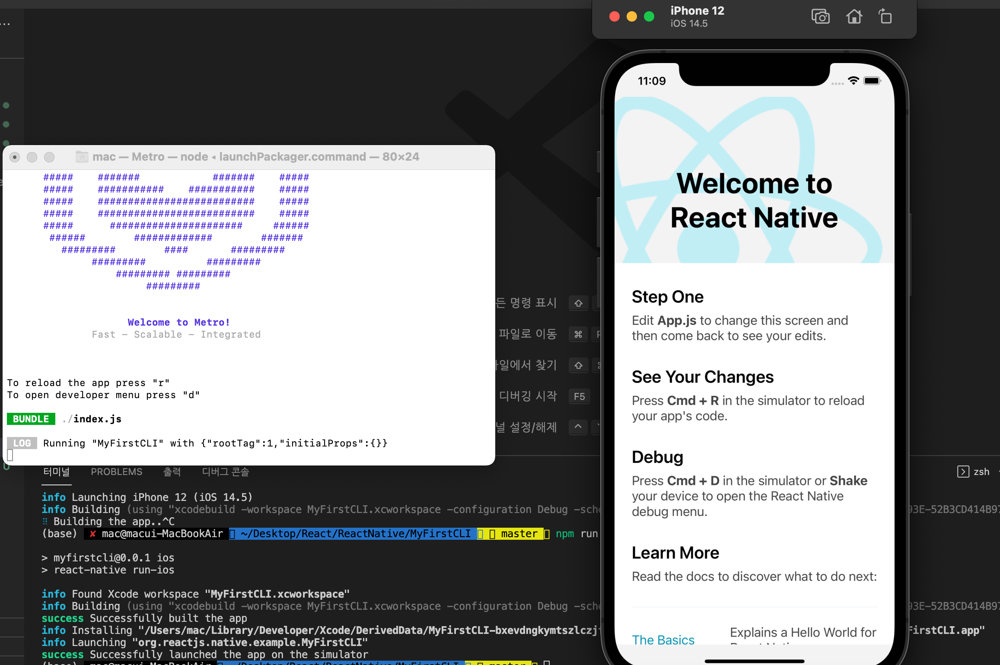

# 다른 방법으로 프로젝트 생성하기

---

다음 명령어를 이용해서 리액트 네이티브 CLI 프로젝트를 생성하겠습니다.

```
npx react-native init MyFirstCLI
```

명령어로 MyFirstCLI 프로젝트를 생성한다.<br>
프로젝트 생성이 완료되면 프로젝트 폴더로 이동해서 프로젝트를 실행해봅니다.

```
npm run ios
npm run android
```

위 의 명령어로 simulator를 켤 수 있다.<br>



명령어를 시작하게 되면 Metro가 실행되고 자바스크립트를 컴파일하는 역활을 하게 된다.

