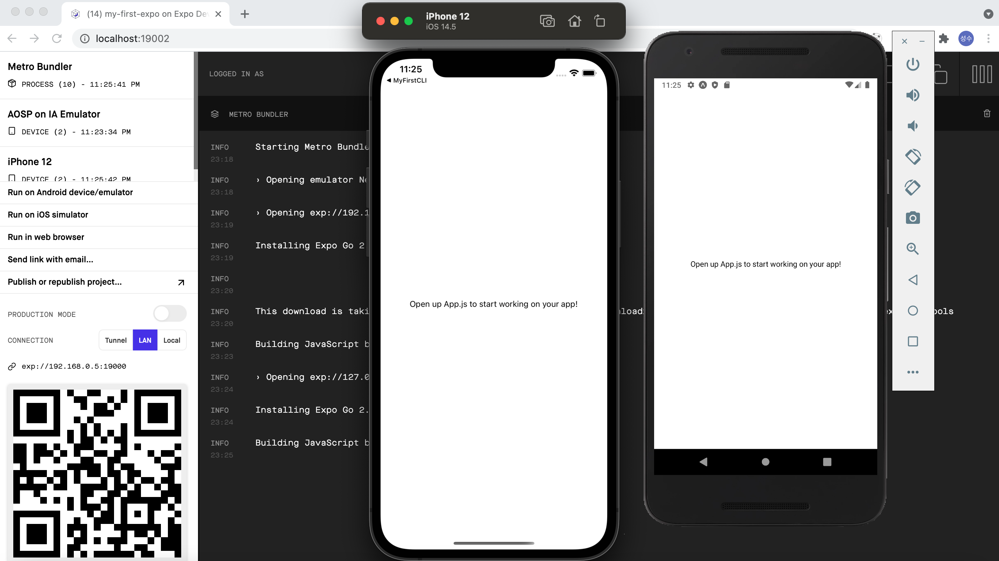

# 리액트 네이티브 시작하기

---

처음으로 expo 를 이용하여 react-native를 해보겠다.

```
npm install --global expo-cli
```

설치가 완료되면 다음 명령어로 Expo 프로젝트를 생성합니다.

```
expo init my-first-expo
```

Expo로 명령어를 입력하면 프로젝트가 생성된다.<br>
리액트 네이티브를 시작하기 앞서서는 안드로이드 스튜디오나, xcode가 설치가 되어 있어야 한다.<br>

my-first-expo 에서 ```npm start``` 로 시작 할 수 있다.



npm으로 시작을 하면 ios나 android 로 시작하면 사진과 같이 시작된다.
(제가 macbook air 로 시작해서 그런지 노트북이 터질듯 쿨러가 돌아가고 있다 😂)